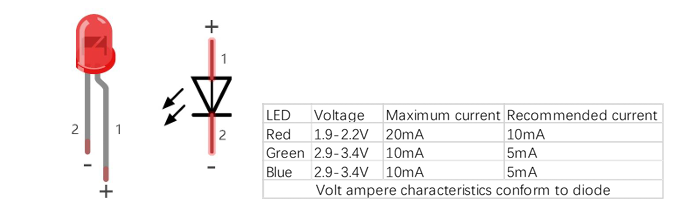
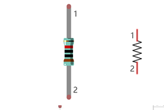

## 🔴 LED (Light Emitting Diode)

A **LED** is a special type of **diode** — an electronic component that allows current to flow in only one direction, much like a **one-way street**.

### ✅ How It Works:
- LEDs have **two terminals (pins)**:
  - The **longer pin** is the **positive (+)** (anode)
  - The **shorter pin** is the **negative (-)** (cathode), which connects to **GND** (ground)
- A LED **only lights up** when the current flows from the positive (+) to the negative (-) terminal.

> ⚠️ **Important**: LEDs typically operate safely between **1.9V and 3.4V**. Supplying more than **3.3V without protection** can **damage or burn out** the LED.



### ❗ Never Connect a LED Directly to Power:
To protect the LED, always use a **resistor in series**. This limits the current and prevents damage.

---

## 🟡 Resistor

A **resistor** is a **passive component** that limits or controls the flow of current in a circuit. It is measured in **Ohms (Ω)**.

### Resistance Units:
- **1 kΩ** = 1,000 Ω  
- **1 MΩ** = 1,000 kΩ = 1,000,000 Ω

### Symbol and Appearance:
- Left: Physical resistor  
- Right: Circuit diagram symbol



### Color Bands:
Resistors use **colored bands** to indicate their resistance values. See the **appendix** for a detailed resistor color code chart.

---

## ⚡ Ohm’s Law

The relationship between **voltage (V)**, **current (I)**, and **resistance (R)** is defined by:

```
I = V / R
```

Where:  
- **I** = Current (Amperes, A)  
- **V** = Voltage (Volts, V)  
- **R** = Resistance (Ohms, Ω)

### Example Calculation:
If you apply **5V** across a **10 kΩ resistor**:

```
I = 5V / 10,000Ω = 0.0005A = 0.5mA
```
